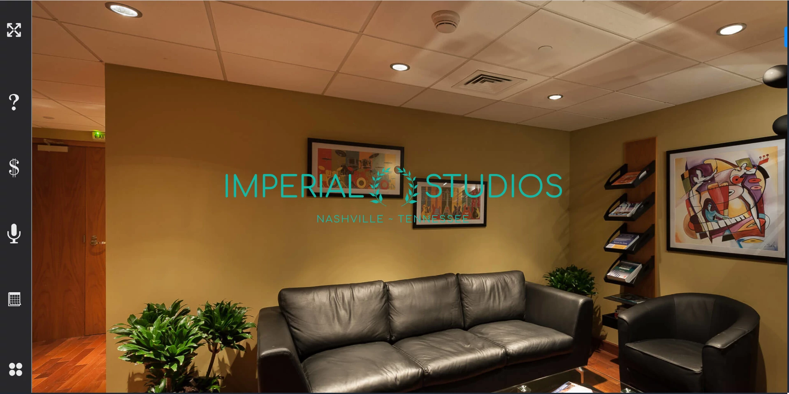

# IMPERIAL STUDIOS - A MOCK NEXT.JS SINGLE PAGE PARALLAX SCROLLING WEBSITE (FRONTEND ONLY).

## This is a website I created to showcase some basic NextJS and TailwindCSS features.  Imperial Studios is a made-up recording studio offering 4 different levels of studio packages.   

The site follows best practices in naming conventions, file structure and basic SEO features.  THIS IS NOT FROM ANY TUTORIAL OR 'FOLLOW - ALONG VIDEO'.  I decided to go with only the frontend design to focus on the UI, as I am primarily a frontend UI developer.  

I do have available some full stack and backend work on this github page.  Feel free to look around!

View the live site [here](https://studio-services.vercel.app/).

## CONTACT
[wlowrimore@gmail.com](mailto://wlowrimore@gmail.com) 
[fakenamedev@gmail.com](mailto://fakenamedev@gmail.com) 
[www.linkedin.com](https://www.linkedin.com/in/william-lowrimore-dev) 